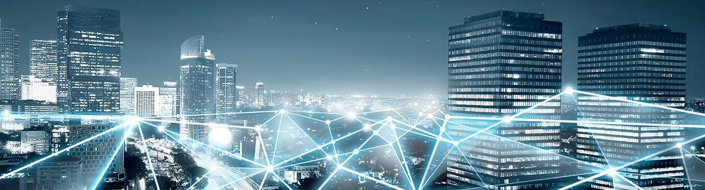

# 1. M146 - Portfolio

### xDSL
xDSL ist eine Sammelbezeichnung für ADSL, HDSL, SDSL, SHDSL, UDSL und VDSL.

Vorteile: 
Mit vDSL ist eine Downloadspeed von bis zu 250Mbit/s und eine Uploadspeed von bis zu 40Mbit/s möglich. vDSL ist bekannt, wegen seiner tiefen Latenzzeit. Ein grosser Vorteil sind, die geringen Kosten im Ausbau im Vergleich zu Glasfaser. 

Nachteile: 
vDSL ist nochmals 10% - 20% teuerer als DSL. Wenn man vDSL verwenden möchte, benötigt man noch spezielle vDSL-Router und vDSL Modems. Bei grösseren Entfernungen sinkt, die Leistung von DSL stark ab. Die Zukunft gehört eher Glasfaser und in den Schweizer Städten ist der grösser Anteil bereits mit Glasfaser versehen. 

### Fibre (FTTH)
Vorteile: 
Glasfaser bietet eine stabile und schnelle Internetanbindung. Es sind Geschwindigkeiten von bis zu 10Gbit's möglich, welche mit alternativen Internettechnologien nicht verglichen werden können. Bei der Glasfaser Technologie hat man den grossen Vorteil, dass es nicht entscheidend ist, ob der Nachbar grosse Datenmengen herunterlädt.

Nachteile: 
Glaskabel hat einen sehr grossen Nachteil, da wenn das Kabel etwas beschädigt wird zum Beispiel, wenn man es knickt, dann sind die Glasfaser gebrochen und man wird nicht mehr auf die Leistung kommen, die man eigentlich gewohnt ist. Gegenüber Radiolink hat Glasfaser eine kleine Verzögerung. Das ist ein Grund, warum bei den Börsen Frankfurt am Main und London auf Radiolink zurückgegriffen wird. In einigen Regionen in der Schweiz ist es noch nicht möglich eine Glasfaser Verbindung zuhaben. Falls man eine Glasfaser Verbindung haben will, muss man mit höheren Kosten rechnen als z.B. bei einem Cable Anschluss.

### Cable
Vorteile: 
Cable hat eine sehr hohe Bandbreite, die Geschwindigkeit kann sogar mit DSL konkurrieren (bis zu 1000 Mbit/s). Über grosse Distanz verliert die Technologie wenig an Bandbreite. Damit ist die Geschwindigkeit nicht abhängig von der Distanz. Cable ist im Vergleich zu anderen Internettechnologien sehr günstig.

Nachteile: 
Alle, die Cable haben hängen an einem Cluster. Das heisst, wenn der Nachbar eine 1 GB Datei herunterlädt habe ich weniger Bandbreite zur Verfügung da er etwas herunterlädt. An diesem Cluster ist nicht nur mein Nachbar, sondern auch viele andere in der Umgebung. Je nach Hausinstallation muss man Änderungen im jeweiligen Haushalt Netz vornehmen. Bei alten Gebäuden könnte dies schwierig gestalten, da die Kabel von dazumal nicht mehr den Standards entsprechen. Generell ist Cable eher eine ältere Technologie, die in der Zukunft immer mehr an Bedeutung verlieren wird.

### Radiolink
Vorteile: 
Bei Radiolink hat man keine Verzögerung, da alles über Echtzeit übertragen wird. Keine andere Technologie überträgt die Daten in Echtzeit. Mit dieser Technologie kann man grosse Distanzen überbrücken. Radiolink bietet ebenfalls die beste Ausfallsicherheit und ist eine kostengünstige Technologie. 

Nachteile:  
Wenn, man diese Technologie in der Nähe von Flughäfen einsetzen möchte, muss man sich das nochmals überdenken. Da der Radiolink das Anflugradar stören kann. Weil Radiolink die Signale auf unterschiedlichen Frequenzen verschickt, kann es zu Problemen kommen, wenn zwei Haushalte nebeneinander das gleiche Signal verwenden.

### Satellit
Vorteile:  
Der grösste Vorteil von Satelliten ist, dass man den Standort ständig ändern kann und trotzdem immer ein Signal hat, solange man im Radius des Satelites ist. Die meisten Schiffe und Flugzeuge haben diese Technologie eingebaut, um genau diesen Vorteil nutzten zu können. Diese Internetverbindung kann man auch zum Telefonieren verwenden, was auf z.B. auf dem Meer ein praktisch ist, da es dort ansonsten kein Signal gibt.
 
Nachteile:  
Leider bietet die Satelliten Technologie eine sehr langsame Geschwindigkeit (max. 150Mbit/s), aufgrund der hohen Distanz, welche das Signal zurücklegen muss. Ebenfalls gibt es noch grösser Verzögerungen der Latenz zwischen 500ms und 700ms, was bei dem TCP Protokoll zu Problemen führen kann.

## Welche Technologie ist für unsere Situation am besten geeignet?
Für unsere Situation eignet sich die ein Glasfaseranschluss (FTTH) am besten. Mit dieser Technologie hat man die bestmögliche Geschwindigkeit und für die Zukunft ist man gut vorbereitet. Die Mitarbeiter des Unternehmens benötigen für meiste Zeit der Arbeit das Internet, weshalb eine gute Verbindung die Arbeitseffizienz steigern kann. Ein Unternehmen mit 90 Mitarbeitern benötigt einen solchen Anschluss, da ansonsten keine angenehme Geschwindigkeit gehalten werden kann. Die Verfügbarkeit der Glasfaser Technologie ist ebenfalls ein entscheidender Faktor in der Wahl der Internetanbindung. Die Kosten für den Einbau der Glasfaser Verbindung kann teurer kommen als bei anderen Technologien, dafür ist es eine einmalige Investition, welche die nächsten Jahre auch bestehend bleiben kann.

## Ausfallsicherheit und Backupleitung
Die Ausfallsicherheit wird von dem Provider angegeben. Meistens werden unterschiedliche Methoden verwendet, um die Ausfallzeit zu Berechnen. Heutzutage wird oft die Methode des MTBF (Mean Time Between Failures) verwendet. Die meisten Provider werden ca. die gleichen Werte bei der Verfügbarkeit anbieten. Dabei muss man bei Vertragsabschlusses die SLA's beachten, in denen die Verfügbarkeit definiert ist.
Die Glasfaser Technologie hat noch den Vorteil, dass anstelle von elektrischen Signalen Licht verwendet, um die Daten zu transferieren, weshalb Magnetfelder oder Starkstromleitungen zu keinen Problemen führen. Jedoch hat Glasfasern das Problem, dass es sehr empfindlich auf Verbiegungen ist, was bei Kupfer Kabel wesentlich besser ist.

## Welche Verbindung eignet sich auch für Backup-Leitungen?
Die höchste Ausfallsicherheit haben DSL, Kabel und Satellitenfunk. Wenn bei zwei Technologien kombiniert hat man natürlich nochmals eine weitere Sicherheit. Trotzdem wird es nicht möglich sein eine Verfügbarkeit von 100% zu gewährleisten. Bei der Verfügbarkeit muss man immer bedenken, je höher die Verfügbarkeit, umso Teurer der Preis. 
Viele Unternehmen nutzen heutzutage noch eine Backup-Leitung über ein 4G Netz, welches bei einem Ausfall des Kabels automatisch auf das 4G Netzwerk wechselt. 

 