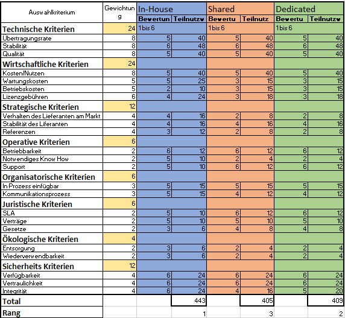

# 1. M146 - Portfolio

## Internet Services
### Eigener Server (Inhouse):
Vorteile: 
Über alle Daten hat man 100 % Zugriffsmöglichkeiten. Falls man weiteren Speicherplatz benötigt, muss man nur die Kosten der Festplatte tragen. Generell muss die ganze Server Hardware einmalig bezahlt werden und nicht in Monatlichen oder jährlichen Kosten.

Nachteile:  
Die Wartung des System, muss man eigenständig durchführen, wofür ausgebildetes Personal benötigt wird. Ebenfalls ist das Person auch für die Sicherheit der Systeme Verantwortlich. Dazu gehört eine zuverlässige Stromversorgung, ein Backup Konzept, Internetverbindung und vieles mehr.
 
Text:
Zu Beginn fallen grosse Investitionskosten an, da die ganze Hardware und Lizenzen gekauft werden müssen. Ebenfalls muss geeignetes Personal für die Installation und zukünftige Wartung eingestellt werden. Falls neue Systeme implementiert werden sollen, kann das von dem Personal selbständig gemacht werden ohne dringende Hilfe von anderen Firmen. Dafür müssen aber auch alle Wartungen und Sicherheitsstandards einhalten. Bis ein Inhouse System aufgebaut und installiert wurde, dauert es meist länger als bei einem Server System beim Provider. Da nicht durchgehend die Daten zum Provider hoch- und heruntergeladen werden müssen, wird die Internetleitung weniger belastet.
Für kleinere Unternehmen ist diese Variante weniger geeignet, aufgrund der hohen Investitionskosten zu Beginn. Bei grösseren Unternehmen kann es Sinn machen die Systeme vor Ort aufzubauen, da man über die Daten immer 100% Zugriffskontrolle hat.
 
### Dedizierte Server (Root-Server):
Vorteile: 
Der Provider ist in der Verantwortlichkeit der Verfügbarkeit. Ebenfalls muss er die Systeme zur Verfügung stellen und je nach SLA's eine gewisse Verfügbarkeit bieten. Die Leistung und der Speicherplatz kann meisten X beliebig erweitert werden ohne grosse zeitliche Verzögerungen.

Nachteile: 
Bei der Verfügbarkeit ist man 100 % auf den Provider angewiesen. Die Kosten fallen generell monatlich an und sind über Jahre gesehen teurer als eine Inhouse System Kosten würde. Ein Server wird für einen Zweck vorhergesehen.
 
Text:
Bei einem Dedicated Server handelt es sich um einen Server, der nur für einen bestimmten Zweck vorgesehen ist. Somit kann die komplette Leistung des Servers nur für eine Aufgabe verwendet werden.
Die Server werden generell gemietet und die Kosten dafür fallen monatlich an. Bei einem Dedicated Server werden die Ressourcen des Servers nur von einem Kunden verwendet und nicht mit anderen geteilt. Dadurch unterscheidet sich ein dedizierter Server von einem Shared Hosting. Deshalb sind die Kosten auch um einiges Höher, was dafür aber die Performance um einiges erhöht.

### Services beim Provider (Shared Hosting):
Vorteile: 
Die Freischaltung des ausgewählten Dienstes/Abos erfolgt innerhalb von kurzer Zeit. Die Kosten fallen monatlich an, sind aber nur kleinere Beträge. Die Updates werden vom Provider automatisch aufgeschalten und für die Sicherheit ist er ebenfalls verantwortlich. 
Freischaltung inert kurzer Zeit, man bezahlt kleine monatliche Kosten (man zahlt schlussendlich für das Abo/Dienst den man gewählt/benötigt hat), Updates werden vom Provider automatisch aufgeschaltet, die Sicherheit der Plattform liegt in der Verantwortlichkeit des Providers. Fix fertige Lösungen werden vom Provider bereitgestellt.
Bei solchen Angeboten (auch bekannt als: Shared Host) werden oft von mehreren Kunden verwendet, die sich somit die Leistung von einem Server teilen müssen.
 
Nachteile: 
Der gemietete Dienst/Abo läuft auf einem Server, worauf auch andere User Zugriff haben. Sprich die Server Ressourcen werden von mehreren Kunden zusammen geteilt.
Bei Ausfällen ist man auf den Provider angewiesen. Kein Zugriff auf Plattform, Upgrades auf dem Hosting werden durch den Provider bestimmt und man kann als einzelner Kunde nicht mit entscheiden. Die Bandbreite ist limitiert. Bei bestimmten Angeboten kann Limitierter Speicherplatz zum Problem werden. 

Text:
Beim Shared Hosting hat man die möglichkeit günstig Dienste auszulagern und nicht mehr selber Verwaltung zu müssen. Durch die Abgabe der Verwaltung gibt man auch einen grossen Teil der Verantwortung ab. Der Provider ist für die Aktualisierung und Instandhaltung des Servers verwantwortlich. Dabei muss er ebenfalls beachten, dass die Zugriffsrechte auf andere Daten von Kunden eingeschränkt sind und die Ressourcen die gekauft werden dem Kunden auch zukommen. Der Anbieter selber bestimmt die einzelnen Serverkonfigurationen und man hat als einer von vielen Kunden kein grosses Mitsprachrecht. Anderungen an der Konfigurationen werden mitgeteilt, weshalb man sich zumindest frühzeitig auf Änderungen anpassen kann.

## Einfache Webpräsenz
Eine Firma mit 10 Mitarbeiter benötigt zum Arbeiten lediglich eine einfache Website und Zugriff auf eine E-Mail Adresse.

Für dieses Beispiel empfehlen wir ein Shared Hosting. Dabei kann man mit monatlichen fixen Kosten rechnen, welches nur sehr kleine Beträge sind. Solche Provider haben sicherlich auch bereits ein passendes Angebot, wodurch zwischen Kauf und Inbetriebnahme der beiden Dienste nicht viel Zeit vergeht. Eine Website und auch einfache E-Mails benötigen keine grossen Datenmengen, weshalb ein geteilter Server dafür völlig ausreicht. Ihre Daten werden vom Provider durch unterschiedliche Sicherheitskonzepte geschützt und ein Datenverlust ist eher unwahrscheinlich. Falls man die Möglichkeit hat, die Daten der Website und der E-Mail Postfächer zu exportieren, ist in Zukunft auch die Möglichkeit offen, wieder aus dem Shared Hosting zu gehen und eine Alternative in Betracht zu ziehen.

## Komplexe Datenbankanwendung mit PHP für den Kundenzugriff
Eine Firma hat 100 Mitarbeiter und die Serverdienste müssen 24/7 zur Verfügung stehen, da die Kunden jederzeit darauf Zugreifen wollen. Die Daten in der Datenbank enthalten vertrauliche Dokumente und müssen vor Verlust wie auch vor Diebstahl gut geschützt werden. Mittlerweile ist die Datenbank sehr gross und es greifen im Minutentakt Kunden aus der ganzen Welt darauf zu.

Hier würden wir zuerst einmal den Root Server empfehlen. Bei dieser Wahl würde ein Server der Firma zur Verfügung stehen, welcher die passenden Ressourcen für die Datenbankanwendung hat. Die Inbetriebnahme würde schnell vonstattengehen. Die Kosten fallen monatlich an und sind höher als bei einer Inhouse Lösung. Der Speicherplatz wäre ausreichend und falls er ergänzt werden sollte, kann das in kürzester Zeit erledigt werden. 
Wenn die Daten aus rechtlichen Gründen nicht unter der Kontrolle des Providers sein dürften, könnte man auch eine Inhouse Lösung in Betracht ziehen. Da muss man jedoch mit hohen Investitionskosten rechnen und ausgebildetes Personal finden.

### Vergleich

 