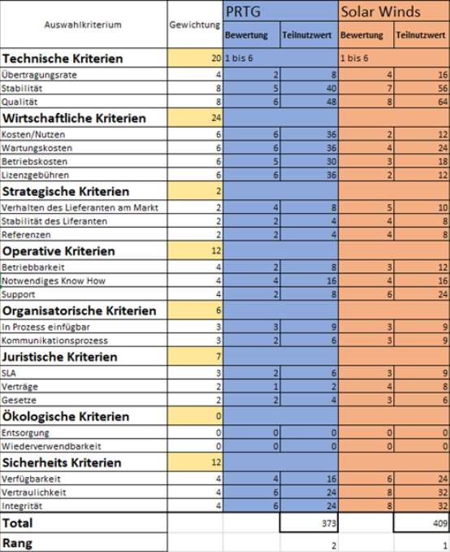

# 1. M146 - Portfolio

## Wartung / Überwachung
Folgende Tools würden wir der Firma empfehlen, um ihren Internetzugang sicherzustellen:

### Wireshark
Der Netzwerk-Sniffer Wireshark ist eine frei erhältliche Software, mit der sich Datenverbindungen auf Protokollebene mitlesen und auswerten lassen. So kann der Data Traffic im Netzwerk genau aufgenommen und analysiert werden. 

### PRTG
Das PRTG überwacht ihr Netzwerk rund um die Uhr und, wenn das Netzwerk ein Fehler hat, gibt die PRTG Software eine Fehlermeldung und markiert das Netzwerk mit Rot. Durch diese Software hat die Systemadministration einen guten Überblick über das System und kann Ausfälle schnell erkennen. Die PRTG hat viele Zusatz Features wie ein Benachrichtigungssystem, GUI, Cluster Failover Lösung, Maps und Dashboards, verteiltes Monitoring und detaillierte Berichte.
### LAN Guard
Ohne Patch-Management ist Ihr Unternehmen zahlreichen Risiken ausgesetzt. Denn fehlende Updates sind die häufigste Ursache für Sicherheitslücken im Netzwerk. Mit GFI LanGuard lassen sich offene Schwachstellen schnell erkennen und rechtzeitig beheben, um Angreifern keine Chance zu geben. 

  

### Solar Winds Netowrk Performance
Netzwerksicherheitsprobleme treten meist dann auf, wenn man die Konfiguration ändert. Mit der Software SolarWinds NPM können diese Fehler und Netzwerk kritischen Konfiguration Änderung rückgängig gemacht und behoben werden. Neben soliden Schwachstellen-Scans und erweiterten Optionen zur Erstellung und Überwachung von Richtlinien ist dies bei weitem die erste Wahl für Netzwerküberwachungssysteme.

### Splunk
Dafür ist Splunk eine gute Wahl, wenn ein Log Tool benötigt wird. Es ist wichtig, eine Art von Log Mechanissmus in einer Firma zu haben. Dadurch kann man einfach an gewünschte Daten kommen.
Splunk ermöglicht es verschiedene Dateien und auch Log Dateien anzuschauen und zu filtern. Somit spart man sich viel Zeit, und bringt Struktur.
 
### Wartung
Der Prozess bei der Wartung läuft über ITSM und dem ITIL Prozess. ITSM ist ein Internet Ticket Tool von BCM. Bei einer Wartung muss ein Change angemeldet werden und auf folgende Kriterien geachtet werden:

* Datum (Start- & Enddatum) -> Einhaltung der SLA
* Configuration Item
* Collision Detection
* Risk Report

Es muss genau angegeben werden, in welcher Zeitperiode die Wartung stattfindet. Diese soll im Normalfall an einem Wochenende stattfinden, ausser es ist ein Notfall und dieser Change ist Betriebskritisch. 
Der Configuration Item muss genau angegeben werden (Hostname und Mac Adresse).
Collision Detection wird automatisch erkennen, ob der gleiche oder andere Hosts um der gleichen Zeit auch einen Change durchführt. 
Beim Produkt Katalog wird beschrieben, welche Applikationen oder Dienste davon betroffen werden. Diese zuständigen Gruppen / Abteilungen müssen diesen Change vor der Durchführung noch genehmigen. Eine definierte Risk Report wird im internen Ticket Tool ITSM ausgefüllt. Bei den Notes wird angefügt, was genau bei diesem Change gemacht werden muss. 

### Vergleich
 
  
