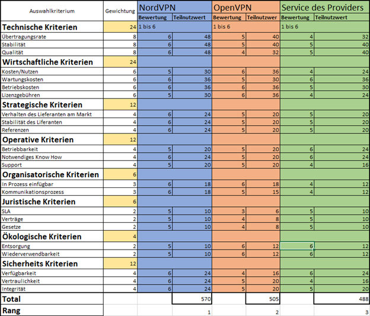

# 1. M146 - Portfolio

## VPN 
Ein VPN ist ein Virtuellen privates Netzwerk welches auf einer öffentlich zugänglichen Infrastruktur basiert. Ausschliesslich wer zu diesem Netzwerk gehört und autorisiert ist kann mit andern Leuten in diesem Netzwerk kommunizieren. So können zum Beispiel Mitarbeiter einer Firma von zu Hause aus in das Firmennetzwerk zugreifen und die infrastruktur der Firma nutzen ohne direkt im Netzwerk sein zu müssen.

## VPN-Achitekturen
### Site-to-Site VPN
Bei einem Site-to-Site werden zwei lokale Netzwerke durch VPN-Gateways verbunden. Es ist die simpelste und am weitesten verbreitete Form von VPNs. Bei einem Site-to-Site VPN werden zwei lokale Netzwerke über ein öffentliches Netzwerk (z.B. Internet).
Der entscheidende Vorteil dieser Lösung liegt in der Tatsache, dass keine der lokalen Arbeitsstationen mit einer speziellen VPN-Software ausgestattet werden muss. Die Gateways übernehmen in diesem Fall die gesamte Gewährleistung der Sicherheit, weshalb das VPN für die im lokalen Netz befindlichen Rechner vollkommen transparent ist.
 
###  End-to-End VPN
Die End-to-End Architektur stellt eine direkte Verbindung zwischen zwei Hosts dar. Die End-to-End Architektur ist die sicherste Lösung für eine VPN-Verbindung, da der Tunnel mit den verschlüsselten Daten die gesamte Verbindung bis zu den Hosts abdeckt (siehe Abb. 2). Damit wäre ein Angriff auf den Verbindungsweg nur schwer durchzuführen und damit fast ausgeschlossen. Der Nachteil dieser Lösung ergibt sich aus der Tatsache, dass jeder der beteiligten Hosts eine spezielle VPN-Software benötigt und weiterhin leistungsstark genug sein sollte, damit Verzögerungen der Verbindung minimiert werden können.
 
  

###  Site-to-End VPN (Remote Access)
Diese Möglichkeit ist eine Kombination aus den beiden vorangegangen VPN-Lösungen. Remote-Access VPNs ermöglichen einen Remotezugriff auf die Ressourcen eines Unternehmens unter Wahrung der Datensicherheit, d.h. es wird eine verschlüsselte Verbindung vom Client zum Firmennetzwerk aufgebaut. Der Client wählt sich zuerst bei seinem Provider ein und baut dann automatisch einen verschlüsselten Tunnel zum VPN-Gateway auf. Alle Clients müssen mit einer speziellen Client-VPN-Software ausgestattet werden. Eine klassische Anwendung stellt die Anbindung von Außendienstmitarbeitern dar (in diesem Falle wird der Client als Roadwarrior bezeichnet).
 
### Hardwarelösung
Da viele NGFWs auch VPN unterstützen und es kaum Hardware gibt welche nur für VPNs hergestellt wird nehmen wir hier wieder den PA-3020 von Paloalto. Dieser ermöglicht 1000 VPN Nutzer was in unserem Fall mehr als ausreicht. Da nicht speziell erwähnt wird, dass viele Mitarbeiter im Homeoffice oder sonst auswärts arbeiten gehen wir davon aus, dass dies kein Schwerpunkt ist, trotzdem ermöglicht der PA-3020 ein VPN für jeden einzelnen Mitarbeiter.

### VPN-Service des Providers
NordVPN ist ein VPN Service welcher Anonymität im Internet gewährleistet. Verbindungen werden immer über einen VPN Server des Providers geleitet und sind zwischen dem Server und dem eigenen Computer immer verschlüsselt.

### PC-Lösung mit Windows oder Linux
OpenVPN bietet sich hier als eine Ideale Lösung an. Die Installation ist sehr einfach und man kann Zertifikate für die jeweiligen Benutzer erstellen. Die Hardware, bei der das interne Ende läuft muss genügend Leistung haben. Am besten empfiehlt sich hier ein Raspberry Pie, als Umgebung zu nützen.
 
Hier sieht man wie sich ein System prima mit einer Umgebung in Verbindung setzt. Wir haben hierfür ein Beispiel für die Amazon World Services genommen. 

  
 
### Vergleich
  
  
