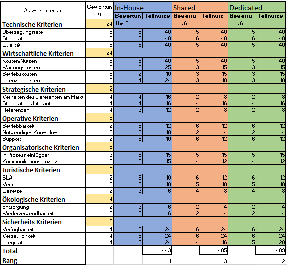

# 1. M146 - Portfolio

 
## Internetanbindung für ein Unternehmen realisieren.
## 17.09.2021 - 28.09.2021
 

Jonah Gutknecht Thomas Züger 
Technische Berufsschule Zürich  
Ausstellungsstrasse 70 Zurich, 8005  
Klasse: St19a  
Gruppennummer: 05  
Präsentationsthema: GNS 3  
Datum Präsentation: 28.09.2021   

# 2. Inhaltsverzeichnis <omit in toc>
- [1. M146 - Portfolio](#1-m146---portfolio)
  - [Internetanbindung für ein Unternehmen realisieren.](#internetanbindung-für-ein-unternehmen-realisieren)
  - [17.09.2021 - 28.09.2021](#17092021---28092021)
- [2. Inhaltsverzeichnis <omit in toc>](#2-inhaltsverzeichnis-omit-in-toc)
  - [Auftrag](#auftrag)
  - [Ausgangslage](#ausgangslage)
  - [Themen](#themen)
    - [Übertragungsrate, Verfügbarkeit](#übertragungsrate-verfügbarkeit)
    - [Wie viel bei Internen Server:](#wie-viel-bei-internen-server)
  - [WAN-Technologie](#wan-technologie)
    - [xDSL](#xdsl)
    - [Fibre (FTTH)](#fibre-ftth)
    - [Cable](#cable)
    - [Radiolink](#radiolink)
    - [Satellit](#satellit)
  - [Welche Technologie ist für unsere Situation am besten geeignet?](#welche-technologie-ist-für-unsere-situation-am-besten-geeignet)
  - [Ausfallsicherheit und Backupleitung](#ausfallsicherheit-und-backupleitung)
  - [Welche Verbindung eignet sich auch für Backup-Leitungen?](#welche-verbindung-eignet-sich-auch-für-backup-leitungen)
  - [Internet Services](#internet-services)
    - [Dedizierte Server (Root-Server):](#dedizierte-server-root-server)
    - [Services beim Provider (Shared Hosting):](#services-beim-provider-shared-hosting)
  - [Einfache Webpräsenz](#einfache-webpräsenz)
  - [Komplexe Datenbankanwendung mit PHP für den Kundenzugriff](#komplexe-datenbankanwendung-mit-php-für-den-kundenzugriff)
    - [Vergleich](#vergleich)
  - [Sicherheit](#sicherheit)
    - [ISO Reihe 27000](#iso-reihe-27000)
    - [Vertraulichkeit](#vertraulichkeit)
    - [Integrität](#integrität)
    - [Authentizität und Authentisierung](#authentizität-und-authentisierung)
    - [Zurechenbarkeit:](#zurechenbarkeit)
    - [Nicht-Abstreitbarkeit](#nicht-abstreitbarkeit)
    - [Verlässlichkeit](#verlässlichkeit)
    - [Zugriffskontrolle](#zugriffskontrolle)
  - [Sicherheitskonzept](#sicherheitskonzept)
    - [Technische Massnahmen](#technische-massnahmen)
    - [Nicht Technische Massnahmen](#nicht-technische-massnahmen)
  - [Wartung / Überwachung](#wartung--überwachung)
    - [Wireshark](#wireshark)
    - [PRTG](#prtg)
    - [LAN Guard](#lan-guard)
    - [Solar Winds Netowrk Performance](#solar-winds-netowrk-performance)
    - [Splunk](#splunk)
    - [Wartung](#wartung)
    - [Vergleich](#vergleich-1)
  - [Firewall](#firewall)
    - [Günstige Firewalls](#günstige-firewalls)
    - [Anforderungen](#anforderungen)
    - [Optional](#optional)
    - [PC-Lösung mit Linux](#pc-lösung-mit-linux)
    - [Anforderungen](#anforderungen-1)
    - [Firewall-Service des Providers](#firewall-service-des-providers)
    - [Vergleich](#vergleich-2)
  - [VPN](#vpn)
  - [VPN-Achitekturen](#vpn-achitekturen)
    - [Site-to-Site VPN](#site-to-site-vpn)
    - [End-to-End VPN](#end-to-end-vpn)
    - [Site-to-End VPN (Remote Access)](#site-to-end-vpn-remote-access)
    - [Hardwarelösung](#hardwarelösung)
    - [VPN-Service des Providers](#vpn-service-des-providers)
    - [PC-Lösung mit Windows oder Linux](#pc-lösung-mit-windows-oder-linux)
    - [Vergleich](#vergleich-3)
- [Quellenverzeichnis](#quellenverzeichnis)

 
 
## Auftrag
Sie untersuchen in Gruppen die unten aufgeführten Themen im Zusammenhang mit der Internetanbindung eines Unternehmens. Dazu sollen Sie zu jedem Thema:
-  Zu jedem Thema die Leitfragen bearbeiten. Neue Fachwörter erklären und Zusammenhänge möglichst in einer grafischen Darstellung visualisieren.
-  verschiedene Realisierungsmöglichkeiten (-Varianten) zeigen und erläutern.

Zu zwei Themen sollen Sie in der Gruppe:

- Vergleichskriterien bestimmen und damit die Realisierungsmöglichkeiten bewerten.
- Typische Einsatzfälle definieren, und aus deren Sicht mit möglichen Vergleichskriterien gewichten.

Sie werden die Erkenntnisse zu allen Themen in einer Dokumentation zusammenfassen und zusätzlich zwei Themen in einem Vortrag präsentieren.
 
Die Dokumentation soll im Sinne eines Leitfadens Ihre gesammelten Erkenntnisse, Empfehlungen und Varianten enthalten.
 
Zu zwei Themen soll auch eine Entscheidungstabelle erstellt werden und eine Entscheidungstabelle soll in der Präsentation vorgestellt werden. Für einen konkreten Einsatzfall sollen Sie zu einem Entscheid für eine bestimmte Variante kommen. 

## Ausgangslage
Ein Unternehmen hat einen veralteten Internetzugang mit einer Übertragungsrate von 50 Mbit/s im Download und 5 Mbit/s im Upload mit ADSL. Die Firma produziert Kaffeemaschinen in einer städtischen Gegend in der Schweiz. Das Marketing benutzt moderne Webapplikationen mit viel Multimediaanwendungen und ein Shop für Endkunden ist ebenfalls vorhanden. Alle Mitarbeiten-den benutzen Mail und Browserapplikationen. Die Firma hat 90 Internetnutzer.
Eine Firewall ist nicht vorhanden und die Server stehen alle beim Provider.

## Themen
### Übertragungsrate, Verfügbarkeit

Da die Server momentan noch bei dem Provider stehen, wäre es empfehlenswert den Internetzugang mit SDLS zu verwenden damit der Down- und Uploadspeed die gleiche Übertragunsrate bietet. Da die Server nicht Inhouse stehen, müssen viele Daten täglich auf die Server hochgeladen werden, da ist ein guter Uploadspeed ebenfalls so wichtig wie der Downloadspeed. Da die meisten SDLS Anbieter auf 100Mbit/s limitiert sind, wäre eine Glasfaser Verbindung zu Empfehlen. Durch die Städtischen Gegend sollte ein Glasfaser Zugang kein Problem sein und die Kosten sollten den Rahmen auch nicht sprengen. In der Schweiz bieten Provider Glasfaser mit einer Rate von bis zu 10Gbit/s an. Mit dieser Rate, können die Mitarbeiter effizient und mit wenig Verzögerung Arbeiten. Durch dieses Upgrade wäre die Firma für die nächsten Jahre sehr gut ausgerüstet und muss in nächster Zeit mit keiner weiteren Investiotion in dem Bereich des Internetzugangs rechnen.

### Wie viel bei Internen Server:

Wenn die Server inhouse verwaltet werden, fällt beim Upload Speed die Gewichtung schwächer aus. Trotzdem würden wir weiterhin bei einem Internetzugang mit Glasfaser bleiben, weil die Schweizer Städte bereits sehr gut mit Glasfaser Verbindung ausgestattet sind. Die modernen Webapplikationen und Multimediaanwendungen können nur mit einem guten Internetzugang reibungslos funktionieren, weshalb eine Investiton in den Bereich Glasfaser Verbindung eine gut Wahl ist. Auch wenn die Firma in den nächsten Jahren noch weiterhin wächst und sich die Mitarbeiterzahl vergrössert wird eine Glasfaser Leitung mit 1Gbit völlig aussreichen. Vielleicht müsste man noch auf eine 10Gbit/s Leitung gehen, falls der Webshop viel Bandbreite verbraucht.
Wir empfehlen der Firma noch eine Firewall zu installieren, da ohne eine Firewall eine grosse Sicherheitslücke besteht. Da alle Mitarbeiter mit dem Internet Arbeitet, könnte jeder Mitarbeiter ein potentielles Sicherheitsrisiko sein.

1. Fall 1, Ausfall von 10h tolerierbar:  
Bei der suche nach dem richtigen Angebot, sollte die Ausfallzeit nicht grösser als 8h sein, dadurch hätte der Kunde noch 2h Zeit übrig, Falls das Problem nicht innerhalb der 8h gelöst werden kann. Bei einem Ausfall von über 10h würde das Geschäft grösse Schäden davontragen. Damit der Provider dieser Pflicht auch nachgeht ist es wichtig vorab bereits in einem Vertrag die SLA's zu definieren und zu bestätigen.
Ebenfalls wichtig ist dabei darauf zuachten, dass der Support eine gute Verfügbarkeit hat und bei Störungen aktiv Kommuniziert wird, wie es mit der Problem Lösung voran geht. 

2. Fall 2, Ausfall von 4h nicht tolerierbar:  
Wenn bereits ein Ausfall von 4h nicht mehr toleriert werden kann, müsste jedes Problem nach 3h gelöst sein, damit im Notfall noch 1h als reserve vorhanden wäre. Bei einer solchen Situation wäre es am besten zwei Internetanbindungen von unterschiedlichen Provider zu haben, damit man bei einem Ausfall auf die zweite Verbindung zurückgreifen kann. Dadurch wäre eine Verfügbarkeit von 99.9% realistisch.
Die Kosten für eine Redundante Internetanbindung sind natürlich höher aber falls dadurch nur ein Ausfall von mehr als 4h verhinder werden kann, haben sich die erhöhten Kosten ausbezahlt. Auch wenn es dadurch eine erhöhte Verfügbarkeit gibt, müssen trotzdem zwingen SLA's mit den beiden Providern definiert werden, damit sie auch in der Pflicht sind die Probleme trotzdem innerhalb von 3h zu lösen.

 
Provider:
- Swisscom
- Sunrise
- UPC
- Solnet
- Init7  
In diesem Falle ist unserer Meinung nach die Swisscom mit dem Produkt «IP Plus Business Internet Service» am besten geeignet.
 

Begründung für Unser Entscheid:
* Wählbare Verfügbarkeit Optionen und Service Levels. Stellen eine Hohe Verfügbarkeit zur Verfügung.
* Garantierte Symmetrische Bandbreiten bis zu 10 Gbit/s auf Glasfaser.
* Möglichkeit für ein Mobile Backup
* Service Down Time Frei wählbar,  
	* SDT4= Störungsbehebung innert 4H
    * SDT1 Light= Störungsbehebung innert 1h (Router Redundanz vorhanden)
  * SDT1= Störungsbehebung innert 1h (Router Redundanz vorhanden + getrennte Wegführung [2te Abgetrennte Leitung])
  *  Störungsannahme, 24/7 Hotline
   * Proaktive Überwachung des Backbones
    * Supportzeite in in 3 Ausprägungen:
      * Standard Support= Mo-Fr 07:00-18:00
      *  Extended Support= Mo-Sa 06:00-22:00
      * Full Support= 7 x 24H
      *  Möglichkeit für eine Störungsbehebung ausserhalb der Supportzeiten (Kostenpflichtig)         	
      *  Auslastungsstatistik im Kundencenter ersichtlich.
                           	
Bei diesem Produkt ist zudem noch eine Dual Provider Solution möglich.
 
Somit kann die Leitung an die exakten Bedürfnisse des Kunden angepasst werden, wie z.B an die Arbeitszeit und die Ausfalllänge. 

 
 
## WAN-Technologie
### xDSL
xDSL ist eine Sammelbezeichnung für ADSL, HDSL, SDSL, SHDSL, UDSL und VDSL.

Vorteile: 
Mit vDSL ist eine Downloadspeed von bis zu 250Mbit/s und eine Uploadspeed von bis zu 40Mbit/s möglich. vDSL ist bekannt, wegen seiner tiefen Latenzzeit. Ein grosser Vorteil sind, die geringen Kosten im Ausbau im Vergleich zu Glasfaser. 

Nachteile: 
vDSL ist nochmals 10% - 20% teuerer als DSL. Wenn man vDSL verwenden möchte, benötigt man noch spezielle vDSL-Router und vDSL Modems. Bei grösseren Entfernungen sinkt, die Leistung von DSL stark ab. Die Zukunft gehöhrt eher Glasfaser und in den Schweizer Städten ist der grösser Anteil bereits mit Glasfaser versehen. 

 

### Fibre (FTTH)
Vorteile: 
Glasfaser bietet eine stabile und schnelle Internetanbindung. Es sind Geschwindigkeiten von bis zu 10Gbit's möglich, welche mit alternativen Internettechnologien nicht verglichen werden können. Bei der Glasfaser Technologie hat man den grossen Vorteil, dass es nicht entscheidend ist, ob der Nachbar grosse Datenmengen herunterlädt.

Nachteile: 
Glaskabel hat einen sehr grossen Nachteil, da wenn das Kabel etwas beschädigt wird zum Beispiel, wenn man es knickt dann sind die Glasfaser gebrochen und man wird nicht mehr auf die Leistung kommen, die man eigentlich gewohnt ist. Gegenüber Radiolink hat Glasfaser eine kleine Verzögerung. Das ist ein Grund warum bei den Börsen Frankfurt am Main und London auf Radiolink zurückgegriffen wird. In einigen Regionen in der Schweiz ist es noch nicht möglich eine Glasfaser Verbindung zuhaben. Falls man eine Glasfaser Verbindung haben will, muss man mit höheren Kosten rechnen als z.B. bei einem Cable Anschluss.

 

### Cable
Vorteile: 
Cable hat eine sehr hohe Bandbreite, die Geschwindigkeit kann sogar mit DSL konkurrieren (bis zu 1000 Mbit/s). Über grosse Distanz verliert die Technologie wenig an Bandbreite. Damit ist die Geschwindigkeit nicht abhängig von der Distanz. Cable ist im Vergleich zu anderen Internettechnologien sehr günstig.

Nachteile: 
Alle die Cable haben hängen an einem Cluster. Das heisst, wenn der Nachbar eine 1 GB Datei herunterlädt habe ich weniger Bandbreite zur Verfügung da er etwas herunterlädt. An diesem Cluster ist nicht nur mein Nachbar, sondern auch viele andere in der Umgebung. Je nach Hausinstallation muss man Änderungen im jeweiligen Haushalt Netz vornehmen. Bei alten Gebäuden könnte dies schwierig gestalten, da die Kabel von dazumal nicht mehr den Standards entsprechen. Generell ist Cable eher eine ältere Technologie die in der Zukunft immer mehr an Bedeutung verlieren wird.

 

### Radiolink

Vorteile: 
Bei Radiolink hat man keine Verzögerung, da alles über Echtzeit übertragen wird. Keine andere Technologie überträgt die Daten in Echtzeit. Mit dieser Technologie kann man grosse Distanzen überbrücken. Radiolink bietet ebenfalls die beste Ausfallsicherheit und ist eine kostengünstige Technologie. 

Nachteile:  
Wenn, man diese Technologie in der Nähe von Flughäfen einsetzen möchte, muss man sich das nochmals überdenken. Da der Radiolink das Anflugradar stören kann. Weil Radiolink die Signale auf unterschiedlichen Frequenzen verschickt, kann es zu Problemen kommen, wenn zwei Haushalte nebeneinander das gleiche Signal verwenden.

 

### Satellit

Vorteile:  
Der grösste Vorteil von Satelliten ist, dass man den Standort ständig ändern kann und trotzdem immer ein Signal hat, solange man im Radius des Satelites ist. Die Meisten Schiffe und Flugzeuge haben diese Technologie eingebaut, um genau diesen Vorteil nutzten zu können. Diese Internetverbindung kann man auch zum Telefonieren verwenden, was auf z.B. auf dem Meer ein praktisch ist, da es dort ansonsten kein Signal gibt.
 
Nachteile:  
Leider bietet die Satelliten Technologie eine sehr langsame Geschwindigkeit (max. 150Mbit/s), aufgrund der hohen Distanz, welche das Signal zurücklegen muss. Ebenfalls gibt es noch grösser Verzögerungen der Latenz zwischen 500ms und 700ms, was bei dem TCP Protokoll zu Problemen führen kann.

## Welche Technologie ist für unsere Situation am besten geeignet?
Für unsere Situation eignet sich die ein Glasfaseranschluss (FTTH) am besten. Mit dieser Technologie hat man die bestmögliche Geschwindigkeit und für die Zukunft ist man gut vorbereitet. Die Mitarbeiter des Unternehmens benötigen für meiste Zeit der Arbeit das Internet, weshalb eine gute Verbindung die Arbeitseffizienz steigern kann. Ein Unternehmen mit 90 Mitarbeitern benötigt einen solchen Anschluss, da ansonsten keine angenehme Geschwindigkeit gehalten werden kann. Die Verfügbarkeit der Glasfaser Technologie ist ebenfalls ein entscheidender Faktor in der Wahl der Internetanbindung. Die Kosten für den einbau der Glasfaser Verbindung kann teurer kommen als bei anderen Technologien, dafür ist es eine einmalige Investition, welche die nächsten Jahre auch bestehend bleiben kann.

## Ausfallsicherheit und Backupleitung
Die Ausfallsicherheit wird von den Provider angegeben. Meistens werden unterschiedliche Methoden verwendet um die Ausfallzeit zu Berechnen. Heutzutage wird oft die Methode des MTBF (Mean Time Between Failures) verwendet. Die meisten Provider werden ca. die gleichen Werte bei der Verfügbarkeit anbieten. Dabei muss man bei Vertragsabschlusses die SLA's beachten, in denen die Verfügbarkeit definiert ist.
Die Glasfaser Technologie hat noch den Vorteil, das anstelle von elektrischen Signalen Licht verwendet um die Daten zu transferieren, weshalb Magnetfelder oder Starkstromleitungen zu keinen Problemen führen. Jedoch hat Glasfasern das Problem, dass es sehr empfindlich auf Verbiegungen ist, was bei Kupfer Kabel wesentlich besser ist.

## Welche Verbindung eignet sich auch für Backup-Leitungen?
Die höchste Ausfallsicherheit haben DSL, Kabel und Satellitenfunk. Wenn bei zwei Technologien kombiniert hat man natürlich nochmals eine weitere Sicherheit. Trotzdem wird es nicht möglich sien eine Verfügbarkeit von 100% zu gewährleisten. Bei der Verfügbarkeit muss man immer bedenkten, je höher die Verfügbarkeit umso Teurer der Preis. 
Viele Untenehmen nutzen heutzutage noch eine Backup Leitung über ein 4G Netz, welches bei einem Ausfall des Kabels automatisch auf das 4G Netzwerk wechselt. 

   
  
  
## Internet Services
3.1 Eigener Server (Inhouse):
Vorteile: 
Über alle Daten hat man 100% Zugriffsmöglichkeiten. Falls man weiteren Speicherplatz benötigt, muss man nur die Kosten der Festplatte tragen. Generell muss die ganze Server Hardware einmalig bezahlt werden und nicht in Monatlichen oder Jährlichen Kosten.

Nachteile:  
Die Wartung des System muss man eigenständig durchführen, wofür ausgebildetes Personal benötigt wird. Ebenfalls ist das Person auch für die Sicherheit der Systeme Verantwortlich. Dazu gehört eine Zuverlässige Stromversorgung, ein Backupkonzept, Internetverbindung und vieles mehr.
 
Text:
Zu Beginn fallen grosse Investitionkosten an, da die ganze Hardware und Lizenzen gekauft werden müssen. Ebenfalls muss geeignetes Personal für die Installation und zukünftige Wartung eingestellt werden. Falls neue Systeme implementiert werden sollen, kann das von dem Personal selbständig gemacht werden ohne dringende Hilfe von anderen Firmen. Dafür müssen aber auch alle Wartungen und Sicherheitsstandards einhalten. Bis ein Inhouse System Aufgebaut und installiert wurde, dauert es meist länger als bei einem Server System beim Provider. Da nicht durchgehend die Daten zum Provider hoch- und heruntergeladen werden müssen, wird die Internetleitung weniger belastet.
Für kleinere Unternehmen ist diese Variante weniger geeignet, aufgrund der hohen Investitionskosten zu Beginn. Bei grösseren Unternehmen kann es Sinn machen die Systeme vor Ort aufzubauen, da man über die Daten immer 100% Zugriffskontrolle hat.

 
 
 
### Dedizierte Server (Root-Server):
 
Vorteile: 
Der Provider ist in der Verantworlichkeit der Verfügbarkeit. Ebenfalls muss er die Systeme zur Verfügung stellen und je nach SLA's eine gewisse Verfügbarkeit bieten. Die Leistung und der Speicherplatz kann meisten X Beliebig erweitert werden ohne grosse Zeitliche Verzögerungen.

Nachteile: 
Bei der Verfügbarkeit ist man 100% auf den Provider angewiesen. Die Kosten fallen generell monatlich an und sind über Jahre gesehen teuerer als eine Inhouse System Kosten würde. Ein Server wird für einen Zweck vorhergesehen.

 
Text:
Bei einem Dedicated Server handelt es sich um einen Server, der nur für einen bestimmten Zweck vorgesehen ist. Somit kann die komplette Leistung des Servers nur für eine Aufgabe verwendet werden.
Die Server werden generell gemietet und die Kosten dafür fallen monatlich an. Bei einem Dedicated Server werden die Ressourcen des Servers nur von einem Kunden verwendet und nicht mit anderen geteilt. Dadurch unterscheidet sich ein Dedizierter Server vone einem Shared Hosting. Deshalb sind die kosten auch um einiges Höher, was dafür aber die Performance um einges erhöht.

 

### Services beim Provider (Shared Hosting):
Vorteile: 
Die Freischaltung des ausgewählten Dienstes/Abos erfolgt innerhalb von kurzer Zeit. Die Kosten fallen monatlich an, sind aber nur kleinere Beträge. Die Updates werden vom Provider automatisch aufgeschalten und für die Sicherheit ist er ebenfalls verantwortlich. 
Freischaltung innert kurzer Zeit, man bezahlt kleine monatliche Kosten (man zahlt schlussendlich für das Abo/Dienst den man gewählt/benötigt hat), Updates werden vom Provider automatisch aufgeschaltet, Die Sicherheit der Plattform liegt in der Verantwortlichkeit des Providers. Fix fertige Lösungen werden vom Provider bereitgestellt.
Bei solchen Angeboten (auch bekannt als: Shared Host) werden oft von mehreren Kunden verwendet, die sich somit die Leistung von einem Server teilen müssen.
 
Nachteile: 
Der gemietete Dienst/Abo läuft auf einem Server, worauf auch andere User Zugriff haben. Sprich die Server Ressourcen werden von mehreren Kunden zusammen geteilt.
Bei Ausfällen ist man auf den Provider angewiesen. Kein Zugriff auf Plattform, Upgrades auf dem Hosting werden durch den Provider bestimmt und man kann als einzelner Kunde nicht mit entscheiden. Die Bandbreiten ist Begrenzung durch den Provider oder durch andere User. Bei bestimmten Angeboten kann Limitierter Speicherplatz zum Problem werden.
 

Text:
Beim Shared Hosting hat man die möglichkeit günstig Dienste auszulagern und nicht mehr selber Verwaltung zu müssen. Durch die Abgabe der Verwaltung gibt man auch einen grossen Teil der Verantwortung ab. Der Provider ist für die Aktualisierung und Instandhaltung des Servers verwantwortlich. Dabei muss er ebenfalls beachten, dass die Zugriffsrechte auf andere Daten von Kunden eingeschränkt sind und die Ressourcen die gekauft werden dem Kunden auch zukommen. Der Anbieter selber bestimmt die einzelnen Serverkonfigurationen und man hat als einer von vielen Kunden kein grosses Mitsprachrecht. Anderungen an der Konfigurationen werden mitgeteilt, weshalb man sich zumindest frühzeitig auf Änderungen anpassen kann.

 
## Einfache Webpräsenz
Eine Firma mit 10 Mitarbeiter benötigt zum Arbeiten lediglich eine einfache Website und Zugriff auf eine E-Mail Adresse.

Für dieses Beispiel empfehlen wir ein Shared Hosting. Dabei kann man mit monatlichen fixen Kosten rechnen, welches nur sehr kleine Beträge sind. Solche Provider haben sicherlich auch bereits ein passendes Angebot, wodurch zwischen Kauf und Inbetriebnahme der beiden Dienste nicht viel Zeit vergeht. Eine Website und auch einfache E-Mails benötigen keine grossen Datenmengen, weshalb ein geteilter Server dafür völlig ausreicht. Ihre Daten werden vom Provider durch unterschiedliche Sicherheitskonzepte geschützt und ein Datenverlust ist eher unwahrscheinlich. Falls man die möglichkeit hat die Daten der Website und der E-Mail Postfächer zu exportieren, ist in Zukunft auch die Möglichkeit offen, wieder aus dem Shared Hosting zu gehen und eine Alternative in Betracht zu ziehen.

## Komplexe Datenbankanwendung mit PHP für den Kundenzugriff
Eine Firma hat 100 Mitarbieter und die Serverdienste müssen 24/7 zur Verfügung stehen, da die Kunden jederzeit darauf Zugreiffen wollen. Die Daten in der Datenbank enthalten Vertrauliche Dokumente und müssen vor Verlust wie auch vor Diebstahl gut geschützt werden. Mittlerweile ist die Datenbank sehr gross und es greiffen im Minutentakt Kunden aus der ganzen Welt darauf zu.

Hier würden wir zu erst einmal den Root Server empfehlen. Bei dieser Wahl würde ein Server der Firma zur Verfügung stehen, welcher die passenden Ressourcen für die Datenbankanwendung hat. Die Inbetriebnahme würde schnell vonstatten gehen. Die Kosten fallen momatlich an und sind höher als bei einer Inhouse Lösung. Der Speicherplatz wäre ausreichend und falls er ergänzt werden sollte, kann das in kürzester Zeit erledigt werden. 
Wenn die Daten aus rechtlichen Gründen nicht unter der Kontrolle des Providers sein dürften, könnte man auch eine Inhouse Lösung in betracht ziehen. Da muss man jedoch mit hohen Investitionskosten rechnen und ausgebildetes Personal finden.

### Vergleich

 
 
## Sicherheit
### ISO Reihe 27000
Die ISO Reihe 27000 gibt einen allgemeinen Überblick über die informations-Sicherheit der Mgmt Systeme. Hier befinden die grundlegende Prinzipien, Konzepte, Begriffe und Definitionen für ISMS (Information Security Management System).

Bei der Sicherheit wird die Frage nach der Verfügbarkeit gestellt. Systeme und Rechenzentren können mit verschiedenste attacken angegriffen werden wie durch einen Denial of Service (DDOS) Attack. Die ISO 27000 beschäftigt sich genau in diesem Fachbereich. Jedoch sollte man vor Beginn des Aufbaus eines Hoch Redundantes System eine Checkliste durchführen. Anhand dieser Checkliste kann genau ermitteln, wo und welches System mit welcher Priorität eingestuft werden muss.

  
Anhand dieser Grafik kann man seine Systeme einstufen. Hier werden zum Beispiel Finanzdienstleister ganz oben links bei der Kurve eingestuft und kleine Coiffeur Betriebe ganz unten Recht in der Kurve. 

### Vertraulichkeit
Bei der Vertraulichkeit geht es um den Schutz von sensiblen Daten im Betrieb. Dies werden meisten mit “Public”, “Internal”, “Confidential” und “Secret vermerkt” Public sind diese Daten, die jeder im Netz sehen darf, also diese die schon Zum Beispiel auf einer Website zu sehen sind. Internal sind Daten, die nur Mitarbeiter vom selben Betrieb sehen dürfen. Dies können Dokumentationen, Anleitungen oder auch Kundenaccounts. Confidential sind dann schon sehr strenge Dokumenten wie Offerten, die auf keinen Fall bei der Öffentlichkeit bekannt sein dürfen. Secret Dokumente sollen sehr Geheim und in einem sehr kleinen Radius verteilt werden. Diese sind dann Geschäftskritische Daten wie Rezepte oder Bilanzen. 

### Integrität
Bei der Integrität geht es darum, wer auf welche Daten oder System Zugriffe haben sollte. Zum Beispiel dürfen Personen aus dem Kaufmännischen Bereich kein Zugriff auf Administratoren Konten oder gar auf Jumpservers haben. So könnten diese Zugriffe missbraucht werden und dies könnte dem Betrieb viel Geld und Zeit kosten. Deswegen soll man sich immer zuerst die Fragen stellen wenn es um den Zusammenhang mit den Internetanbindungen von Firmen geht:

* Wie viele Mitarbeiter müssen darauf Zugriff haben?  
* Arbeiten auch Externe Personen damit?  
* Welche Zugriffe haben Externe (VPN)?

### Authentizität und Authentisierung
Netzwerkfähige Geräte sollten immer mit starken Passwörtern gesichert sein. Es muss immer klar sein, wer und wieso hat jemand Zugriffe auf solche Systeme oder Geräten. Zudem muss man sich bei der Authentisierung diese Frage überlegen:

* Welches Verfahren soll zum Einsatz kommen? 1,2 oder 3 Stufiges Konzept?
* Sind Biometrische Daten auch erwünscht? (BSP: Physische Datacenter Zugriff)  

### Zurechenbarkeit:
Dateien, Mails und Briefe sollen immer einem Owner gewährleistet sein. So können bei Fragen und unklarheiten dieser Owner angefragt werden. Dieser Owner ist auch für die Annahme oder ABlehnung von Berechtigungen auf seine Dateien zuständig. Mails sollen zudem auch immer signiert werden. 

### Nicht-Abstreitbarkeit
Dieses Sicherheitsanforderung gilt an Web-Shops. Aus Sicht der Internetanbindungen soll man sich fragen, ob ein Webshop im Einsatz ist und ob Bestellungen via Mail oder via des WEB erfolgen. Dies muss man dokumentieren. 
### Verlässlichkeit
Die Verlässlichkeit spielt eine grosse Rolle mit der Wartung der Internetzugänge. Daher müssen folgende Fragen gestellt werden:

* Wie ist die Wartung organisiert?
* Sind die Systeme zuverlässig gewartet?
* Werden Backups gemacht?
* Werden Patches regelmässig eingespielt?
* Ist PKI (Public key Infrastructure) im Einsatz?
* Werden die Vulnerabilitäts Datenbanken regelmässig konsultiert?
* Werden ihre Firewalls intern oder extern gemanaged?
* Ist der BSI Grundschutz implementiert?

### Zugriffskontrolle
Bei der zugriffskontrolle geht es nicht nur um physische Berechtigung sondern auch um das surfen im Internet. Auf welche Dienste und Webseiten sollen die Mitarbeiter der Firmen zugriff haben und wie lange? Diese Regeln müssen dann überwacht und überprüft werden. 
Zudem soll man jeden Dienst und Ort und die Zugriffsart gut dokumentieren. 
 
## Sicherheitskonzept
### Technische Massnahmen
* Servers müssen durch einen USV Stromzufuhr betrieben werden. 
* Physischer Zugriff für in den DC muss über Biometrisches Verfahren gehen.
* Internetleitungen müssen Redundant sein.
* Auf Netzwerkfähige Geräte im Serverraum wie Router und Switches, muss ein sicheres admin Passwort gesetzt werden.
* Router muss Redundant sein
* Bei den Servern müssen sichere BIOS und Admin Passwörter gesetzt werden. 
* Webserver sollen in einem DMZ stehen und über einen Jump Server erreichbar sein.
* Wenn Externe Mitarbeiter auf den Servers oder Datenbanken zugriff haben sollen, muss ein sicherer VPN eingesetzt werden
* Differentials Backup müssen Täglich vom System gemacht werden.
 
### Nicht Technische Massnahmen
* Abgeschlossener Bereich für den Serverraum
* Offene Switches müssen in einem Kasten / Schrank abgeschlossen werden
* Vendor Escalation für wichtige Systeme / Server müssen genau dokumentiert werden
* Pikett Dienst muss durchgeführt und dokumentiert werden.
* Bei jeder Berechtigungsart muss ein Owner definiert und dokumentiert werden.
* Genaue Dokumentation über zugriffskontrollen auf den Servern müssen laufend gemacht werden.

Sicherheitskonzept nach ISO 27000 für unser Beispiel:
1. Vertraulichkeit: Die Daten auf der Website können als "Public" gekennzeichnet werden. Daten für Mitarbeiter wie z.B. Anleitungen und Dokumentation werden als Confidential markiert. Offerten können in die Kategorie Confidential und streng geheime Dokumente der Geschäftsleitung können als Secret vermerkt werden.
2. Integrität: Bei dem Punkt Integrität muss nur definiert werden, welcher Mitarbeiter auf welche Daten Zugriff hat. Da es keine externe Mitarbeiter gibt, kann das einfacher definiert werden.
3. Authentizität und Authentisierung: Dabei ist wichtig, das überall sichere Passwörter verwendet werden. Für die Mitarbeiter eine Richtlinie hinzugefügt werden, damit Mitarbeiter sichere Passwörter wählen müssen.
4. Zurechenbarkeit: Hierbei müssen alle 90 Mitarbeiter mit einem persönlichen Account Arbeiten, um nachvollziehen zu können, welcher User was gemacht hat. E-Mails sollte zudem immer signiert werden.
5. Nicht-Abstreitbarkeit: Beim Webshop müsste definiert werden, ob die Bestellungen via Mail oder via Web reinkommen sollen. 
6. Verlässlichkeit: Da die Server alle inhouse sind, müssen da natürlich die Wartungen organisiert werden, die Backups in regelmässigen Abständen gemacht werden, Datenbanken regelmässig konsulieren und Patches regelmässig eingespielt werden.
7. Zugriffskontrolle: Da alle Mitarbeiter intensiv mit dem Internet Arbeiten ist es wichig, dass diese nur auf bestimmte Websiten Zugriff haben. Diese Zugriffe müssen im voraus definiert werden und durch Programme sollten dann die verbotenen Websiten gesperrt werden.

Wenn alle 7 Punkte eingehalten werden wird das Sicherheitskonzept nach ISO 27000 eingehalten und das Unternehmen ist Online geschützt unterwegs.

## Wartung / Überwachung
Folgende Tools würden wir der Firma empfehlen, um ihren Internetzugang sicherzustellen:

### Wireshark
Der Netzwerk-Sniffer Wireshark ist eine frei erhältliche Software, mit der sich Datenverbindungen auf Protokollebene mitlesen und auswerten lassen. So kann der Data Traffic im Netzwerk genau aufgenommen und analysiert werden. 

### PRTG
Das PRTG überwacht ihr Netzwerk rund um die Uhr und, wenn das Netzwerk ein fehler hat, gibt die PRTG Software eine Fehlermeldung und markiert das Netzwerk mit Rot. Durch diese Software hat die Systemadministration einen guten Überblick über das System und kann Ausfälle schnell erkennen. Die PRTG hat viele zusatz Features wie ein Benachrichtigungssystem, GUI, Cluster Failover Lösung, Maps und Dashboards, verteiltes Monitoring und detaillierte Berichte.
### LAN Guard
Ohne Patch-Management ist Ihr Unternehmen zahlreichen Risiken ausgesetzt. Denn fehlende Updates sind die häufigste Ursache für Sicherheitslücken im Netzwerk. Mit GFI LanGuard lassen sich offene Schwachstellen schnell erkennen und rechtzeitig beheben, um Angreifern keine Chance zu geben. 

  

### Solar Winds Netowrk Performance
Netzwerksicherheitsprobleme treten meisst dann auf wenn man die Konfiguration ändert. Mit der Software SolarWinds NPM können diese fehler und Netzwerkkritischen kofigurationänderung Rückgängig gemacht und behoben werden. Neben soliden Schwachstellen-Scans und erweiterten Optionen zur Erstellung und Überwachung von Richtlinien ist dies bei weitem die erste Wahl für Netzwerküberwachungssysteme.

### Splunk

Dafür ist Splunk eine gute Wahl, wenn ein Log Tool benötigt wird. Es ist wichtig, eine Art von Log Mechanissmus in einer Firma zu haben. Dadurch kann man einfach an gewünschte Daten kommen.
Splunk ermöglicht es verschiedene Dateien, Meztiken und auch Log Dateien anzuschauen und zu Filtern. Somit spart man sich viel Zeit, und bringt Struktur.

 

 
### Wartung
Der Prozess bei der Wartung läuft über ITSM und dem ITIL Prozess. ITSM ist ein internet Ticket Tool von BCM. Bei einer Wartung muss ein Change angemeldet werden und auf folgende Kriterien geachtet werden:

* Datum (Start- & Enddatum) -> Einhaltung der SLA
* Configuration Item
* Collision Detection
* Risk Report

Es muss genau angegeben werden, in welcher Zeitperiode die Wartung stattfindet. Diese soll im normalfall an einem Wochenende stattfinden, ausser es ist ein Notfall und dieser Change ist Betriebskritisch. 
Der Configuration Item muss genau angegeben werden (Hostname und Mac Adresse).
Collision Detection wird automatisch erkennen, ob der gleiche oder andere Hosts um der gleichen Zeit auch einen Change durchführt. 
Beim Produkt Katalog wird beschrieben, welche Applikationen oder Dienste davon betroffen werden. Diese zuständige Gruppen / Abteilungen müssen diesen Change vor der Durchführung noch genehmigen. Eine definierte Risk Report wird im internen Ticket Tool ITSM ausgefüllt. Bei den Notes wird angefügt, was genau bei diesem Change gemacht werden muss. 

 
### Vergleich
 
  

 
## Firewall 
Eine Firewall ist essentiell und es ist nur eine Frage der Zeit bis ein ungebetener Gast sich im eigenen Netzwerk umschaut, es führt also kein Weg an einer Firewall vorbei. Es gibt drei Arten von Firewall lösungen: Hardware-Firewalls, PC Lösungen und Firewall Services vom eigenen Provider z.B. Diese werden hier anschliessend verglichen.
### Günstige Firewalls
Die Fortigate ist einer der Markführenden Firewalls im KMU bereich. Sie unterstützt mit verschiedensten Features und Add ons gute Security defaults und man kann sehr gut schon das eigene Netzwerk überwachen. Diese NGFW hat einen Durchsatz von über 2 Gbit/s, unterstützt mehrere  VLANs, und bietet eine eigene VPN Lösung. Hier bei empfiehlt sich am besten die Fortigate 60E Edition.

### Anforderungen
* Glasfaser Kabel
* Internetanbindung

### Optional
* Serverrack
* Switch
* Router

### PC-Lösung mit Linux
OPNsense ist eine Open Source Firewall Lösung welche für FreeBSD entwickelt wurde und somit auch auf Linux läuft. Es werden Multi WAN, VPN, 2FA und viele weitere nützliche Features unterstützt. 
Ein Grosser Vorteil von OPNSense ist das dieser Dienst kostenlos ist und er wird immer stetig verbessert. Durch Wöchentliche Securtiy updates von OPNSense ist man immer gut unterwegs mit der eigenen Netzwerk-Sicherheit 

### Anforderungen
* Glasfaser Kabel
* Linux als OS
* Betriebssysteme 

### Firewall-Service des Providers
Jeder Internet Provider hat bereits seine eigene Firewall. Damit kann man einen gewissen Teil der Viren bereits abfangen. Diese Art von Firewalls bieten den Vorteil, dass man sich um nichts kümmern muss bzw. Einstellungen nicht selbstständig vornehmen muss sondern alles bei Provider in Auftrag geben kann. Ein Nachteil ist aber, man kann Änderungen nicht selbst vornehmen und somit muss man immer warten bis der Provider die Änderung vorgenommen hat.

### Vergleich

 
  

## VPN 
Ein VPN ist ein Virtuellen Privates Netzwerk welches auf einer öffentlich zugänglichen Infrastruktur basiert. Ausschliesslich wer zu diesem netzwerk gehört und autorisiert ist kann mit andern Leuten in diesem Netzwerk kommunizieren. So können zum Beispiel Mitarbeiter einer Firma von zu Hause aus in das Firmennetzwerk zugriefen und die infrastruktur der Firma nutzen ohne direkt im Netzwerk sein zu müssen.
## VPN-Achitekturen
### Site-to-Site VPN
Bei einem Site-to-Site werden zwei lokale Netzwerke durch VPN-Gateways verbunden. Es ist die simpelste und am weitesten verbreitete Form von VPNs. Bei einem Site-to-Site VPN werden zwei lokale Netzwerke über ein öffentliches Netzwerk (z.B. Internet).
Der entscheidende Vorteil dieser Lösung liegt in der Tatsache, dass keine der lokalen Arbeitsstationen mit einer speziellen VPN-Software ausgestattet werden muss. Die Gateways übernehmen in diesem Fall die gesamte Gewährleistung der Sicherheit, weshalb das VPN für die im lokalen Netz befindlichen Rechner vollkommen transparent ist.
 
###  End-to-End VPN
Die End-to-End Architektur stellt eine direkte Verbindung zwischen zwei Hosts dar. Die End-to-End Architektur ist die sicherste Lösung für eine VPN-Verbindung, da der Tunnel mit den verschlüsselten Daten die gesamte Verbindung bis zu den Hosts abdeckt (siehe Abb. 2). Damit wäre ein Angriff auf den Verbindungsweg nur schwer durchzuführen und damit fast ausgeschlossen. Der Nachteil dieser Lösung ergibt sich aus der Tatsache, dass jeder der beteiligten Hosts eine spezielle VPN-Software benötigt und weiterhin leistungsstark genug sein sollte damit Verzögerungen der Verbindung minimiert werden können.
 
  

###  Site-to-End VPN (Remote Access)
Diese Möglichkeit ist eine Kombination aus den beiden vorangegangen VPN-Lösungen. Remote-Access VPNs ermöglichen einen Remotezugriff auf die Ressourcen eines Unternehmens unter Wahrung der Datensicherheit, d.h. es wird eine verschlüsselte Verbindung vom Client zum Firmennetzwerk aufgebaut (siehe Abb 3). Der Client wählt sich zuerst bei seinem Provider ein und baut dann automatisch einen verschlüsselten Tunnel zum VPN-Gateway auf. Alle Clients müssen mit einer speziellen Client-VPN-Software ausgestattet werden. Eine klassische Anwendung stellt die Anbindung von Außendienstmitarbeitern dar (in diesem Falle wird der Client als Roadwarrior bezeichnet).
 
 

### Hardwarelösung
Da viele NGFWs auch VPN unterstützen und es kaum Hardware gibt welche nur für VPNs hergestellt wird nehmen wir hier wieder den PA-3020 von Paloalto. Dieser ermöglicht 1000 VPN Nutzer was in unserem Fall mehr als ausreicht. Da nicht speziell erwähnt wird, dass viele Mitarbeiter im Homeoffice oder sonst auswärts arbeiten gehen wir davon aus, dass dies kein Schwerpunkt ist, trotzdem ermöglicht der PA-3020 eine VPN für jeden einzelnen Mitarbeiter.

### VPN-Service des Providers
NordVPN ist ein VPN Service welcher anonymität im Internet gewährleistet. Verbindungen werden immer über einen VPN Server des Providers geleitet und sind zwischen dem Server und dem eigenen Computer immer verschlüsselt.

### PC-Lösung mit Windows oder Linux
OpenVPN bietet sich hier als eine Ideale Lösung an. Die Installation ist sehr einfach und man kann Zertifikate für die jeweiligen Benutzer erstellen. Die Hardware bei der das interne Ende Läuft muss genügend Leistung haben. Am Besten empfiehlt sich hier ein Raspberry Pie als Umgebung zu nützen.
 
Hier sieht man wie sich ein System prima mit einer Umgebung in Verbindung setzt. Wir haben hierführ ein Beispiel für die Amazon World Services genommen. 

  
 
### Vergleich
  
  

# Quellenverzeichnis

Thema	Quelle
Sicherheit	https://www.evolit.ch/Portals/0/Content/04_Verifizierung/04-02_ISO27000/EVL_ISO27K-Info_V1-00.pdf

Firewall 	https://www.fortinet.com/de/products/next-generation-firewall
Firewall	https://www.fortinet.com/content/dam/fortinet/assets/data-sheets/FortiGate_FortiWiFi_60E_Series.pdf
Firewall	https://en.wikipedia.org/wiki/Next-generation_firewall
VPN	https://openvpn.net/
VPN	https://nordvpn.com/
Wartung	https://networkx.github.io/
WAN (FTTH)	https://de.wikipedia.org/wiki/Glasfasernetz#Fibre_to_the_home

WAN (FTTH)	https://community.fs.com/de/blog/the-advantages-and-disadvantages-of-fiber-optic-transmission.html

WAN (Satellit)	https://de.wikipedia.org/wiki/Internetzugang_%C3%BCber_Satellit#Vorteile

WAN (Kabel)	http://www.appenzeller-online.de/kabel/kabel-internet-oder-dsl.htm

WAN (xDSL)	
Server:
Dedicated,
InHouse,
Shared	Dedicated
 Inhouse
 Shared

Übertragungsrate	Produkt

Monitoring	https://www.comparitech.com/net-admin/network-monitoring-tools/

WAN 	https://www.0und1.net/index.php/wanbuendelung

 
Glossar

Thema	Abkürzung	Erklärung
Firewall	NGFW	NGFW steht für Next Generation Firewall und ist eine Firewall der dritten Generation. Das spezielle an dieser Technologie ist, dass weitere Applikationen zur ursprünglichen Firewall hinzugefügt werden. Das bedeutet, viele NGFW haben eine eigene VPN Funktion, eine application firewall welche deep packet inspection, tls/ssl inspection, bandbreitenmanagement und antivirus inspection unterstützt. Das Ziel von NGFWs ist, weitere OSI Layers zu untersuchen und z.B. direkt in den Inhalt von PDFs in Email Anhängen zu schauen, was Der Application Layer ist.
		